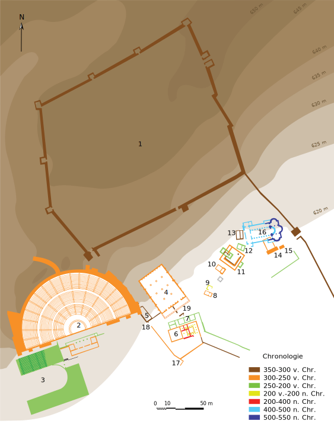

Het **orakel van Dodona** (Oudgrieks: Δωδώνη / Dôdốnê) met een eikenbos en een tempel was gewijd aan Zeus Naios en de moedergodin, hier vereerd onder de naam van Dione. Het lag in Epirus aan de 

## Oorsprong

TEKST

## Geschiedenis

TEKST

## Het orakel

TEKST

## Vereerde goden

TEKST

## Bronnen

Orakel van Dodona. (2021, juli 8). Wikipedia, de vrije encyclopedie. Opgehaald 15:01, juli 31, 2023 van https://nl.wikipedia.org/w/index.php?title=Orakel_van_Dodona&oldid=59470769.
